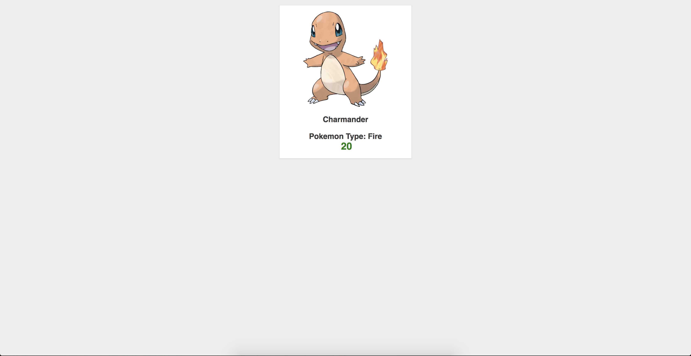
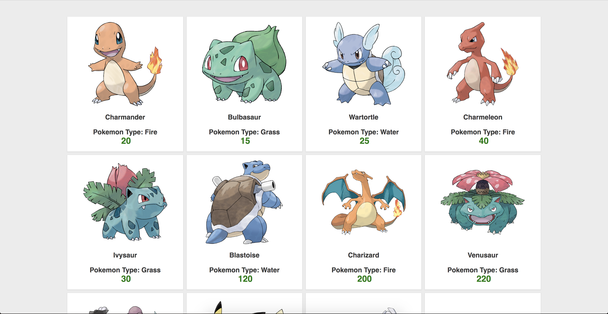
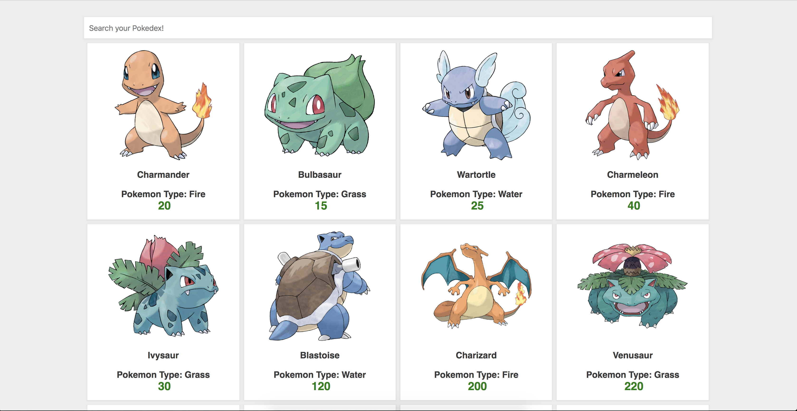

# Pokedex React Store

Understand how the structure of the React component looks like
and start doing the exercises

All the pokemon assets and information are provided in `data.txt`
The css for this exercise is given in `index.css` or feel free to customise the page to your liking

### Exercise 1
* Create a single pokemon card in JSX
* Take a single pokemon data provided in `data.txt` to display in `Card` component
* Data should be placed in App.js and be passed down. Think top-down approach. Data is passed down to another component
* Capitalise property `type` in each individual `Card` component

### Exercise 2
* Convert a single card to a list of cards. Tip[Use the `map` higher order function]

### Exercise 3
* Add a search input at the top of the page and implement Pokemon Search by Name. Tip[Use the `filter` higher order function]
  * Start with getting familiar with the input controlled component
  * The search is triggered by the `onChange` handler

### Exercise 4
* Render different background color based on the pokemon type
  * fire: "#fe7500"
  * water: "#6a87f3"
  * grass: "#53d34e"
  * thunder: "#e3c260"
  * psychic: "#ff2482"
  * ice: "#b282f2"
